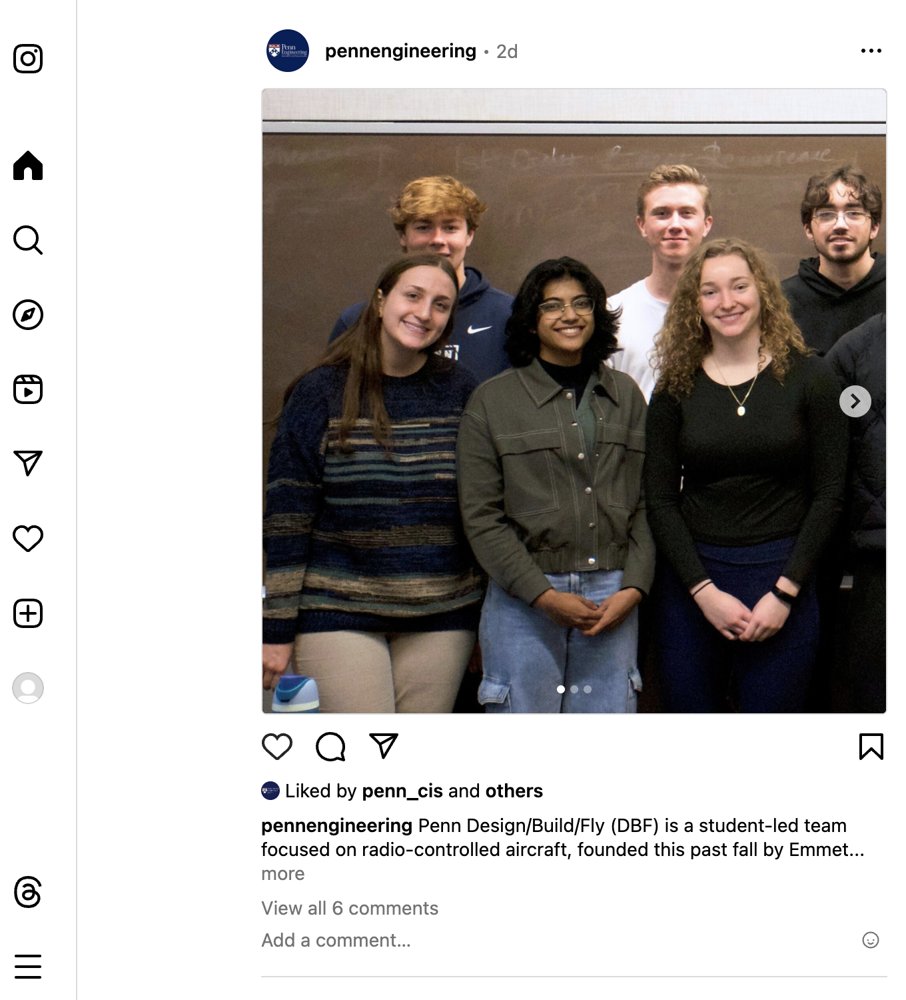

[](https://classroom.github.com/a/sYr67WnG)
# NETS 2120 Course Project

## Milestones and Deadlines
* Teams of 4 must form by **Friday, April 5, 2024**
* Four group check-ins with your shepherd TA, no later than **4/19, 4/24, 5/1, and 5/6**
* Code and report due in Gradescope on **May 6, 2024**
* Demos during **finals week** (May 6-14)

All deadlines are at 11:59 PM Eastern Time.

## Overview

The course project will involve building "InstaLite," an Instagram-like social media site with full support for images (and optionally videos). This project is to be done in *teams* and will build upon components you built over the semester in your homeworks.

*Instructors' note*: During interviews, companies often ask you to tell them about a technical project you worked on. If you invest enough time, this project can play that role; you can add it to your “portfolio” of system that you can show a potential employer!  (We do ask that you keep your repo private, however.)

*General Advice*: Read through this entire document and compile a list of (1) data resources you'll need to design, (2) backend endpoints, (3) frontend pages / widgets, (4) interfaces to additional components such as ChatGPT and Apache Spark. Try to establish "core" functionality and build outwards.

## Project Technology Stack

Your project will have a number of elements, building upon what you did with the homework. We expect the following:

* **Backend** services in Node.js and/or Java, hosted on Amazon EC2 (you may use `nginx` to make these accessible through the same TCP port)
* **Database** (accounts, social network, etc.) hosted in RDS and/or DynamoDB (many aspects will work better in RDS)
* **Image search** based on embeddings similarity, in ChromaDB
* Large objects stored in S3, as necessary
* **Natural language search** using GPT or an alternative LLM
* Social **news streaming** via Apache Kafka
* Adsorption ranking of posts and individuals via Apache Spark
* Proper handling of security and sessions
* **Frontend** in React and Javascript
* Code in GitHub

## User Signup and User Accounts Backend

New users should be able to sign up for an account. They should enter, at the very least, a login name, a password, a first and last name, an email address, an affiliation (such as Penn), and a birthday.

* The password should be *salted* and encrypted following best practices.
* Users should be able to *upload a profile photo* -- on mobile, perhaps even taking a selfie for that photo -- as a starting point.
* Users should include a number of hashtags of interests.  The top-10 most popular hash tags (by occurrence) should be shown so they have a starting point.

The user should be able to link to a given *actor account* from IMDB by matching the *embedding* of their selfie with the *profile photos* of the 5 most similar actors.  They will be able to choose from those actors.

We will provide you with a set of actor embeddings and profile photos in the form of a ChromaDB database. You should use this to match the user's selfie to the actor's profile photos.

## User Login Page

The user should be able to log in with their user ID and password. (See Extra Credit for an option for resetting a forgotten password.)

## The User Page / Main Content Feed

When the user logs in, they should see an Instagram-style feed with status updates, new friendships, and profile updates (posts) made by friends. When Alice posts on Bob’s wall, her post should appear on both Alice’s and Bob’s walls and home pages.  Below is an example taken directly from Instagram.



**User Posts**: Each user should be able to make posts, containing an optional image and optional text. The post might include hashtags. Although each field is optional, a post should at least have *some* content to be valid.

**What Goes in the Feed**: Each user should see *posts* from their friends, themselves, as well as from *prominent figures*.  Posts can have text and images.  Some of the posts will also come from the social media stream (see below on **Feed**).

**Commenting**: Users should be able to add a comment under any post they can see (that is, both their own posts and their friends’ posts). These comments should appear under the post they respond to, in a threaded fashion.

The user page should include non-scrolling menu elements on the left (as in the screenshot) or top, for access to other capabilities such as the user profile and search (see below).  The main feed should paginate (default behavior) or support infinite scrolling by fetching more data on demand (see Extra Credit).

### Feed

As with Instagram, your user will see a **feed** of different posts. All posts are public, i.e. they will be considered for the feed based on the criteria below even when the post owner and the user aren't friends. These posts:

1. Come from the user's friends
2. Reference the user's selected hashtags of interests
3. Come from others with high SocialRank
4. Come from the course project **Twitter/X Feed** and score highly.  This will be made accessible to you through an Apache Kafka Topic.

**Feed updates**: Your server, while running, should refresh the data necessary for computing the feed once an hour.  This will involve fetching any "new news" from Kafka and from recent posts / activities; and ranking the content.  If you precompute the data, it should be easy for the client to produce the page upon login.

**User actions**:
Users should be able to “like” posts, and should be able to comment on them.  If a post or comment includes **hashtags** a link between the hashtag and post should be established.

**Ranking posts**: Every candidate post should be assigned (for each user) a weight. Weights will be computed with an implementation of the adsorption algorithm in Spark. This should run periodically, once per hour as descried above.

The Spark job should start by building a graph from the data underlying your social platform. The
graph should have a node for each user, each movie, each hashtag, and each post. It should also have
the following directed edges:

1. `(u, h)` and `(h, u)`, if user `u` has selected hashtag `h` as an interest
2. `(h, p)` and `(p, h)`, if post `p` is associated with hashtag `h`
3. `(u, p)` and `(p, u)`, if user `u` has “liked” post `p`
4. `(u1, u2)` and `(u2, u1)` if users `u1` and `u2` are friends

The Spark jobs should assign weights to the edges.

- For each hashtag node `h`, the weights on the `(h, a)` edges adjacent should be equal and add up
  to 1.
- Similarly, the outgoing edges from a post `p` should have equal weights that sum to 1.
- For each user `u`:
    - The weights on the `(u, h)` edges should be equal and sum up to 0.3
    - The weights on the `(u, p)` edges should be equal and sum up to 0.4
    - The weights on the `(u, u′)` edges should be equal and sum up to 0.3

Now run adsorption from the users to assign a user label + weight to each node (including the article nodes). Run to a maximum of 15 iterations or until convergence. Given the ranked graph as above, the social network recommender should take the set of potential articles (those from the same day, minus ones that have already been recommended), and normalize the adsorption-derived weights on these articles. Then it should randomly choose an article based on this weighted random distribution.

**Interfacing the Spark job with the Web Application**: We recommend your group thinks carefully about how the different components (data storage, Spark job to recompute weights, search / recommendation) interface.  You likely will want to invoke the Spark task via Livy or the equivalent, with an easily configurable address for the Spark Coordinator Node. Most likely you’ll want to use some form of persistent storage (e.g. RDS) to share the graph and other state.

### Federated Posts

Your site should have a *unique ID* distinguishing it from all other NETS 2120 sites. This will be your team number (e.g. `g01`). Through the Kafka `FederatedPosts` channel, your site should both *read* and *send* posts that can be used by other projects' InstaLite sites. Posts should have a JSON component called `post_json`:

```
{
    username: '...',
    source_site: '...',
    post_uuid_within_site: '...',
    post_text: '...',
    content_type: '...'
}
```

as well as a binary component, `attach`, including an optional image.  The `content_type` field in the JSON should be the HTTP content-type associated with the binary data.

## Secondary Screens

There should be at least the following options in a sidebar or other menu:

1. Profile page
2. Add/remove friends
3. Chat mode
4. Search (can be part of the home screen if you prefer)

### 1. Profile Page

Users should be able to change their associated actor after the account has been created. As before, the list of the top-5 most-similar actors (by embedding) should be displayed to allow for a change (they should only be able to pick from these 5). Changes should result in an automatic status post (“Alice is now linked to Rebecca Ferguson”). Users should also be able to change their email ID and their password, without triggering a post.

They should be able to update their hashtags representing interests. Additional hashtags should be suggested to them.

### 2. Add/Remove Friends

**Add/Remove Friends**: Users should be able to add and remove friends, and they should see a list of their current friends. The list of friends should indicate which friends, if any, are **currently logged into the current system**.

**(EC only) Friend Requests**: If a user sends a friend request to another user, the other user should receive a notification of some kind that enables him or her to accept or reject the request. If the request is accepted, the two users should become friends. If the request is rejected, the two users should not become friends.

### 3. Chat Mode

There should be a way for users to chat with each other. You can implement this functionality with basic AJAX requests using polling; for extra credit, consider using WebSockets with socket.io. Read more about the different implementation choices [here](https://medium.com/geekculture/ajax-polling-vs-long-polling-vs-websockets-vs-server-sent-events-e0d65033c9ba).

**Chat invites**: When a user’s friend is currently online, the user should be able to invite the friend to a chat session, and the friend should receive a notification of some kind that enables him or her to join the chat. If the friend accepts the invitation, a chat session should be created between the two users. If the friend rejects the invitation, no chat session should be created.

**Persistence**: The contents of a chat session should be persistent - that is, if two users have chatted before and a new chat session between the same pair of users is established later, the new session should already contain the messages from the previous chat.

**Leaving chat**: Any member of a chat session should be able to leave the chat at any time. The chat should continue to work as long as it contains at least one member. When the last member leaves a chat session, the chat session should be deleted.

**Group chat**: There should also be a way to establish a group chat by inviting additional members to an ongoing chat. When a new member joins a chat, they are able to see previous chat history starting from the creation of the group chat. Each group chat created is a unique and independent chat session, even when the same users are involved (e.g., X, Y, and Z created Chat 1; X, Y, and W created Chat 2; if Z and W leave their chats, X and Y should now have two independent group chats). However, if a new invite results in a chat session involving the same user group as an existing chat session, the invite should not be allowed. You also may not invite an existing member to a chat session.

**Ordering**: The messages in a chat (or group chat) session should be ordered consistently - that is, all members of the chat should see the messages in the same order. One way to ensure this is to associate each chat message with a timestamp, and to sort the messages in the chat by their timestamps.

### 4. Natural Language Search

Uses should be able to search (1) for people, and (2) for posts. These should use *retrieval-augmented generation* over the indexed content of actors, movie reviews, and posts; and should use a Large Language Model to find the best matches.

**EC**: ensure the search results return links so users can add friend / follow / interest based on the returned results.

### Security and Scalability

You should ensure that your design is secure: for instance, users should not be able to impersonate other users (without knowing their password), and they should not be able to modify or delete content that was created by other users. 

Your design should also be scalable: if a million users signed up for your system tomorrow, your system should still work and provide good performance (although of course you will have to add some extra resources, e.g., additional EC2 instances). Keep in mind that many of the cloud services we have discussed, such as DynamoDB and Spark/MapReduce, are naturally scalable.

### Recommend Who and What to Follow

Based on the link structure of the graph as well as the activity and hashtag structure of the streaming posts, your system should on a daily basis recompute a list of recommendations for "who to follow".

### Opportunities for Extra Credit

We will give a liberal amount of extra credit for creativity in the project. Below are some suggestions for extra-credit items:

* (+2) LinkedIn-style friend requests with confirmation (i.e., users can accept or deny friend requests); 
* (+5) A "forgot password" option that sends to the user's email address a password reset token and a link to the password reset screen;
* (+5) Privacy controls (e.g., limiting who can see a particular post);
* (+5) Infinite scrolling;
* (+5) Groups (i.e. ones similar to Facebook communities);
* (+5) Targeted advertising, based on users’ interests or on words in their posts; 
* (+5) Site-wide "what’s trending" feature;
* (+5) WebSockets for chat;
* (+5) The LLM search always returns valid links for search results.

However, these are just examples - feel free to consider other features as well, e.g., based on functionality that the current Facebook has, or even novel features that you define yourself. If you are considering a particular feature and are not sure whether it would be counted as extra credit, feel free to post a question on Ed Discussion. Extra credit will be awarded based on the complexity of a feature, not just based on its presence; for instance, profile pictures are easier than groups and thus would be worth less, and adding a simple input field where users can declare group memberships would yield considerably less extra credit than a full implementation with separate pages for groups where members can post messages, etc.

For this iteration of the course, we do not set a ceiling on the amount of extra credit that can be earned. You may receive over 100% on the project if you implement a large number of extra-credit features.

## Project Report

At the end of the project, your team must include a short final report, as a PDF file of approximately five pages (excluding images) within your GitHub repository. This report, in the final `final-report.pdf`, will be part of your project score; grading will be based both on clarity of writing and on technical content. The report should contain, at least:

* A short overview of the system you built;
* A technical description of the components you built;
* A discussion of nontrivial design decisions;
* A discussion of changes you made along the way, and lessons you learned;
* A brief description of the extra-credit features, if any;
* A series of screenshots of your system in action (one for each main feature/page).

Please try to choose the right level of detail (not too nitty-gritty, not too high-level), and please avoid repeating points that are already in this handout. For instance, don’t write that your solution has a news feed (this was required!); instead, write how you designed the DynamoDB table that the newsfeed uses, and why you did it that way.

## Logistics

### Team Registration

You should form teams of 4 students. You can form your own team, or you can use the discussion group to find teammates. Once you have formed a team, please have one member submit to the Google Form posted on Ed with your team information. If you don't form a team by Friday, April 5, we will assign you to a team via random matching.

### TA Shepherding Process

Once your team has registered, it will be assigned a TA as a “shepherd”. You should schedule 15-minute sessions with your shepherd each week by the dates specified on the first page of this handout. All team members should attend each session. The sessions may either be in-person or virtual.

For the first session, you should prepare 1) a quick overview of your design, and 2) a set of specific milestones for for sessions #2, #3, and #4, subject to the following requirements:

* Each milestone should be associated with one specific team member, who will be responsible for reaching it. It is okay for team members to help each other, but there has to be a single “lead” who will assume responsibility.

* There should be at least two milestones per session for each team member. Each milestone should be specific (e.g., in terms of features implemented and working) and demoable – that is, there should be a way to show later that the milestone has been reached.

* The session-3 milestones should cover at least 1) user registration, 2) the home page, 3) account changes, 4) the list of friends, and 5) having the news articles loaded into the database. The session-4 milestones should cover at least 80% of the basic/required features; it should be clear that the required features can be completed by May 6th. The milestones do not need to cover extra credit.

* The work should be spread roughly uniformly across the project (there should be no weeks that are substantially busier, or less busy, than others) and it should be split roughly equally between the team members.

* The milestones should be concrete tasks that can be clearly demo-ed or measured. Attempt to reduce dependencies between team members as much as possible (e.g., if one team member is blocked, the others should still be able to make progress).

Your shepherd will give you feedback on your materials, and will answer any questions. After the meeting, you should email the (potentially revised) milestones to your shepherd.

Session #1 is a team grade for the submission of draft and revised milestone proposals before and after the meeting, and sessions #2, #3, and #4 are graded on attendance and completion for each individual. Sessions #1, #2 and #4 are each worth 2% of the project score; session #3 will be a ‘mini-demo’ that is worth 4%, where you demo the site functioning as a whole covering the required session-3 features listed above in addition to individual contribution demos. During these sessions, your team should demo the features that have been implemented so far, and your shepherd will compare your progress to the milestones for that session. They will send an email to the entire team, that includes 1) the milestones for this session and the associated “leads”, 2) an estimate of what fraction of each milestone (or rough equivalent thereof) has been completed, 3) a score (based both on how many milestones have been reached and on the quality and completeness of the implementation) of this session for each individual, and 4) any revisions to the remaining milestones. Revisions may be necessary, e.g., if progress has been unexpectedly slow in a certain week, or if certain features turn out to be much harder or easier than anticipated.

Please use the shepherding sessions to ask lots of questions! Your shepherd will have completed a similar project previously from the old iteration of this course, and he or she will have a lot of useful tips and insights to share. Keep in mind, however, that each shepherd was responsible for a particular set of features and may not know the other features in depth, so they may refer you to a different TA for certain questions.

### Project Demos

Your team must do a short demo (about 15-20 minutes) during the finals period. A number of time slots on different days will be posted to Ed Discussion near the end of the semester. We cannot reserve slots or create additional slots, so, if you or some of your team members have constraints (holiday travel, final exams, etc.), please discuss this well in advance and pick a suitable slot. Once your team has reserved a slot, the only way to change the slot is to find another team that agrees to swap slots with you. Slots are first-come, first-served. The signup opening time will be announced a few days in advance via Ed.

All team members must be present in-person on campus for the demo by default. If you have any emergencies or unavoidable conflicts, please let us know as soon as possible by emailing the course staff (yuyingf@seas.upenn.edu). We will allow you to participate remotely in such cases, or exempt you from the demo if necessary. All absences or remote participation without advance notice will result in zero credit for the individual.

### Team Contribution Form

Normally, each member of the team will receive the same score for the project report and demo, but we may deviate from this if it is clear that some team members have made substantially more progress than others. We will send out a Google Form after the report due date to collect feedback from everyone on the team about their estimates on the contribution of each team member. This will be used to adjust the final project score for each team member if needed.

### AWS and OpenAI Accounts

Each team will receive a project AWS Academy account via email during the first week of the project. This account will have a $100 credit. Team members may share access to AWS resources on this account (e.g. DynamoDB tables). It is your responsibility to ensure that you keep your credentials safe and accessible to everyone in your team. Multiple people are allowed to connect to the same Lab session at the same time.

Each team is responsible for the security of its AWS account(s). It is important to make sure that all team members understand how the AWS firewall works, and what a security rule is. In particular, it is critical that all security rules be as restrictive as possible; DO NOT just open all ports to anyone on the whole planet (0.0.0.0/0) because that virtually guarantees that your account will be hacked!

We will have a shared OpenAI API key.  Our expectation is that you will only use a limited number of prompts (<100 requests) so this will be adequate for testing and for the course.  If you need more credits, your team can use your own private key under your own billing.

### GitHub Classroom

This assignment is released as a Group Assignment on GitHub Classroom. One member of your team should create a new repository from the assignment link and ask everyone else to join the same repo after accepting the assignment. You should use this repository to store all of your code and documentation for the project. You should also use this repository to submit your final report.

### Submission Checklist

* Your code contains a reasonable amount of useful documentation.

* You have checked your final code into the Git repository.

* You have removed all AWS credentials from the code you are submitting.

* Your repository contains all the files needed to compile and run your solution (including all .js/.ejs files, and all Spark code); as well as README file that describes 1) the team number and team name, 2) the full names and SEAS login names of all team members, 3) a description of features implemented, 4) any extra credit claimed, 5) a list of source files included, 6) a declaration that all the code you are submitting was written by you, and 7) instructions for building an running your project. The instructions must be sufficiently detailed for us to set up and run your application.

* Please avoid checking your `target` folder in to GitHub. Please do not include large data files (these can be hosted on S3), or your `node_modules`. If you used third-party libraries and are not including them in your submission, please state in the README file what libraries, and include them in the appropriate `pom.xml` or `package.json` files. We have provided a starter `.gitignore`, but you may need to update it as needed.

* You are submitting your final report as a PDF file of no more than five pages (including appendices, screenshots, images, and any references).  This should be called `final-report.pdf` and be in the root of your GitHub project.

* You submitted your GitHub repo with your final report via Gradescope, before the deadline on the first page of this handout. Late hours cannot be used for the project.

